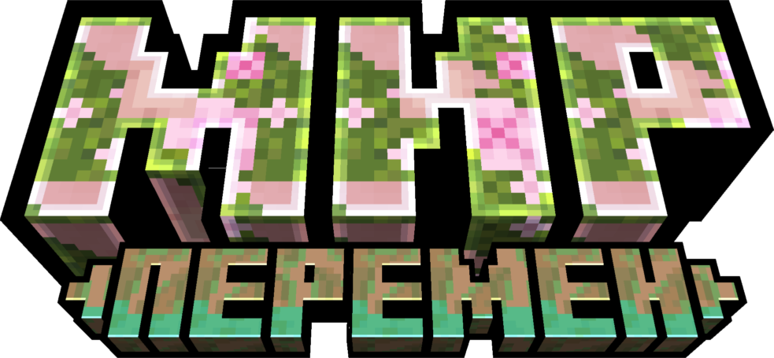

# 🏠 Главная

Добро пожаловать на Wiki Good Wars!

## Здесь мини курс по википедии:


Это блок о информации



Это блок о важном



Это блок ВНИМАНИЕ



Описание под видео


Зарикролен?

* [x] ага!
* [x] ТОЧНО
* [ ] ИДИ ЛЕСОМ

1. Во-первых&#x20;
2. Во-вторых
3. В-третьих


Ссылка на сайт


> Однажды кто-то сказал [**"То, что мы знаем, это капля, а то, что мы не знаем, это океан. "**](#user-content-fn-1)[^1]

Раскрывающаяся штука

ОПА РАСКРЫЛАСЬ&#x20;



Не жми на `Стр 2`



Ай ай ай червяк Плохово не посоветует



<figure><figcaption>
Фотка
</figcaption></figure>


После изучения всех возможных блоков сайта вы можете приступить к ознакомлению с Wiki :tada:


[^1]: [<mark style="color:blue;">**Исаак Ньютон**</mark>](https://ru.wikipedia.org/wiki/%D0%9D%D1%8C%D1%8E%D1%82%D0%BE%D0%BD,\_%D0%98%D1%81%D0%B0%D0%B0%D0%BA) _Физик и математик_
